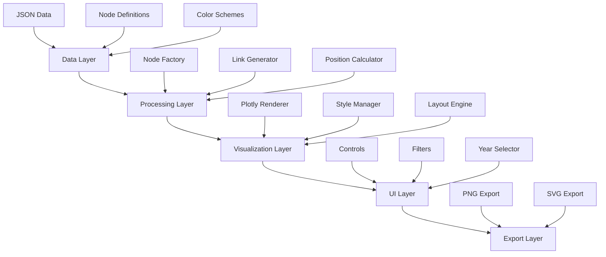

# Design Document

## Overview

Este diseño mejora el diagrama de Sankey interactivo existente para el balance de energía en México, transformándolo en un sistema más robusto, escalable y profesional. El diseño se basa en la arquitectura modular, manteniendo la compatibilidad con los datos existentes mientras introduce mejoras significativas en la visualización, usabilidad y mantenibilidad del código.

## Architecture

### High-Level Architecture



### Modular Structure

El sistema se organizará en módulos independientes:

1. **DataManager**: Manejo de datos y configuraciones
2. **NodeFactory**: Creación y gestión de nodos
3. **LinkManager**: Gestión de enlaces y flujos
4. **LayoutEngine**: Cálculo de posiciones y diseño
5. **StyleManager**: Gestión de colores y estilos
6. **ExportManager**: Funcionalidades de exportación
7. **UIController**: Control de interfaz de usuario

## Components and Interfaces

### DataManager

```javascript
class DataManager {
    constructor(jsonData) {
        this.rawData = jsonData;
        this.processedData = new Map();
        this.nodeDefinitions = new Map();
    }
    
    getNodeData(nodeName) { /* ... */ }
    getYearData(year) { /* ... */ }
    validateData() { /* ... */ }
}
```

### NodeFactory

```javascript
class NodeFactory {
    constructor(styleManager) {
        this.styleManager = styleManager;
        this.nodeRegistry = new Map();
    }
    
    createNode(config) {
        return {
            id: config.id,
            name: config.name,
            type: config.type,
            position: config.position,
            color: this.styleManager.getColor(config.type),
            data: config.data
        };
    }
    
    registerNodeType(type, factory) { /* ... */ }
    createNodesFromData(data, year) { /* ... */ }
}
```

### LinkManager

```javascript
class LinkManager {
    constructor(nodeFactory) {
        this.nodeFactory = nodeFactory;
        this.linkRegistry = [];
    }
    
    createLink(source, target, value, metadata) {
        return {
            source: source,
            target: target,
            value: Math.log10(Math.abs(value) + 1), // Escala logarítmica
            color: this.getSourceColor(source),
            customdata: this.formatPopupText(metadata)
        };
    }
    
    generateLinksFromNodes(nodes, mappings) { /* ... */ }
}
```

### LayoutEngine

```javascript
class LayoutEngine {
    constructor() {
        this.columnDefinitions = new Map();
        this.groupDefinitions = new Map();
    }
    
    calculatePositions(nodes) {
        // Algoritmo mejorado de posicionamiento
        const columns = this.organizeIntoColumns(nodes);
        return this.distributeVertically(columns);
    }
    
    defineColumn(name, xPosition, nodes) { /* ... */ }
    createNodeGroup(name, nodes, style) { /* ... */ }
}
```

### StyleManager

```javascript
class StyleManager {
    constructor() {
        this.colorPalette = new Map();
        this.themeConfig = {};
        this.initializeDefaultColors();
    }
    
    getColor(energyType) { /* ... */ }
    setTheme(theme) { /* ... */ }
    generateColorPalette() { /* ... */ }
}
```

### ExportManager

```javascript
class ExportManager {
    constructor(plotlyInstance) {
        this.plotly = plotlyInstance;
    }
    
    exportToPNG(options = {}) {
        return this.plotly.toImage({
            format: 'png',
            width: options.width || 1920,
            height: options.height || 1080,
            scale: options.scale || 2
        });
    }
    
    exportToSVG(options = {}) { /* ... */ }
}
```

## Data Models

### Node Configuration

```javascript
const NodeConfig = {
    id: String,           // Identificador único
    name: String,         // Nombre para mostrar
    type: String,         // 'primary' | 'secondary' | 'hub' | 'transformation' | 'consumption'
    position: {
        x: Number,        // Posición horizontal (0-1)
        y: Number,        // Posición vertical (0-1)
        column: String    // Columna lógica
    },
    color: String,        // Color hexadecimal
    data: Object,         // Datos específicos del nodo
    metadata: {
        description: String,
        unit: String,
        category: String
    }
};
```

### Link Configuration

```javascript
const LinkConfig = {
    source: String,       // ID del nodo origen
    target: String,       // ID del nodo destino
    value: Number,        // Valor del flujo
    color: String,        // Color del enlace
    metadata: {
        energyType: String,
        year: Number,
        originalValue: Number,
        unit: String
    }
};
```

### Group Configuration

```javascript
const GroupConfig = {
    id: String,           // Identificador del grupo
    name: String,         // Nombre del grupo
    nodes: Array,         // IDs de nodos incluidos
    style: {
        borderColor: String,
        borderStyle: String, // 'solid' | 'dashed' | 'dotted'
        borderWidth: Number,
        backgroundColor: String,
        opacity: Number
    },
    position: {
        padding: Number,   // Espacio interno
        margin: Number     // Espacio externo
    }
};
```

## Error Handling

### Error Types

1. **DataValidationError**: Errores en la estructura de datos
2. **NodeCreationError**: Errores al crear nodos
3. **LinkGenerationError**: Errores al generar enlaces
4. **RenderingError**: Errores de visualización
5. **ExportError**: Errores de exportación

### Error Recovery Strategy

```javascript
class ErrorHandler {
    static handle(error, context) {
        console.error(`Error in ${context}:`, error);
        
        switch (error.type) {
            case 'DataValidationError':
                return this.handleDataError(error);
            case 'RenderingError':
                return this.handleRenderError(error);
            default:
                return this.handleGenericError(error);
        }
    }
    
    static handleDataError(error) {
        // Mostrar mensaje al usuario y usar datos por defecto
        return { success: false, fallback: true };
    }
}
```

## Testing Strategy

### Unit Tests

- **DataManager**: Validación de datos, transformaciones
- **NodeFactory**: Creación de nodos, validación de configuraciones
- **LinkManager**: Generación de enlaces, cálculos de valores
- **LayoutEngine**: Algoritmos de posicionamiento
- **StyleManager**: Gestión de colores y temas

### Integration Tests

- **Data Flow**: Desde carga de datos hasta renderizado
- **User Interactions**: Cambio de año, filtros, exportación
- **Error Scenarios**: Datos faltantes, errores de red

### Visual Tests

- **Snapshot Testing**: Comparación de renderizados
- **Layout Validation**: Verificación de posiciones
- **Color Consistency**: Validación de paleta de colores

## Performance Considerations

### Optimization Strategies

1. **Lazy Loading**: Cargar datos solo cuando sea necesario
2. **Memoization**: Cache de cálculos costosos
3. **Virtual Rendering**: Renderizar solo elementos visibles
4. **Debounced Updates**: Evitar actualizaciones excesivas

### Memory Management

```javascript
class PerformanceManager {
    constructor() {
        this.cache = new Map();
        this.maxCacheSize = 100;
    }
    
    memoize(key, computation) {
        if (this.cache.has(key)) {
            return this.cache.get(key);
        }
        
        const result = computation();
        this.cache.set(key, result);
        
        if (this.cache.size > this.maxCacheSize) {
            const firstKey = this.cache.keys().next().value;
            this.cache.delete(firstKey);
        }
        
        return result;
    }
}
```

## Implementation Phases

### Phase 1: Core Refactoring
- Modularizar código existente
- Implementar DataManager y NodeFactory
- Mejorar sistema de posicionamiento

### Phase 2: Visual Improvements
- Implementar StyleManager
- Mejorar diseño y layout
- Agregar sistema de agrupación

### Phase 3: Advanced Features
- Implementar sistema de filtros
- Agregar funcionalidades de exportación
- Implementar etiquetas dinámicas

### Phase 4: Polish & Documentation
- Optimización de rendimiento
- Documentación completa
- Testing exhaustivo

## Configuration Examples

### Column Definitions

```javascript
const columnConfig = {
    'oferta': {
        x: 0.1,
        title: 'Oferta',
        nodes: ['Producción', 'Importación', 'Variación de Inventarios']
    },
    'hub': {
        x: 0.3,
        title: 'Hub Central',
        nodes: ['Oferta Total (Hub)']
    },
    'transformacion': {
        x: 0.6,
        title: 'Transformación',
        nodes: ['Refinerías', 'Plantas de Gas', 'Centrales Eléctricas']
    },
    'consumo': {
        x: 0.9,
        title: 'Consumo',
        nodes: ['Consumo Final', 'Exportación']
    }
};
```

### Group Definitions

```javascript
const groupConfig = {
    'oferta-group': {
        name: 'Procesos de Oferta',
        nodes: ['Producción', 'Importación', 'Variación de Inventarios'],
        style: {
            borderColor: '#2E8B57',
            borderStyle: 'dashed',
            borderWidth: 2,
            backgroundColor: 'rgba(46, 139, 87, 0.1)'
        }
    },
    'transformacion-group': {
        name: 'Procesos de Transformación',
        nodes: ['Refinerías', 'Plantas de Gas', 'Coquizadoras'],
        style: {
            borderColor: '#FF6347',
            borderStyle: 'dashed',
            borderWidth: 2,
            backgroundColor: 'rgba(255, 99, 71, 0.1)'
        }
    }
};
```